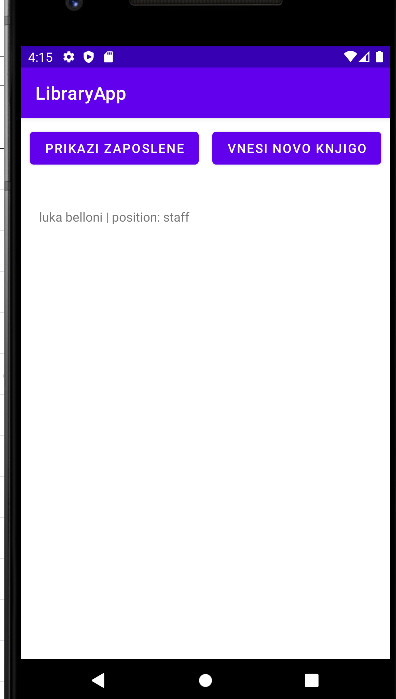
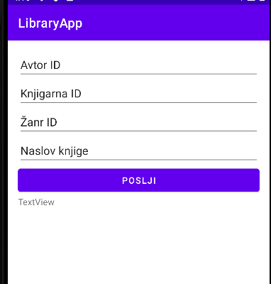
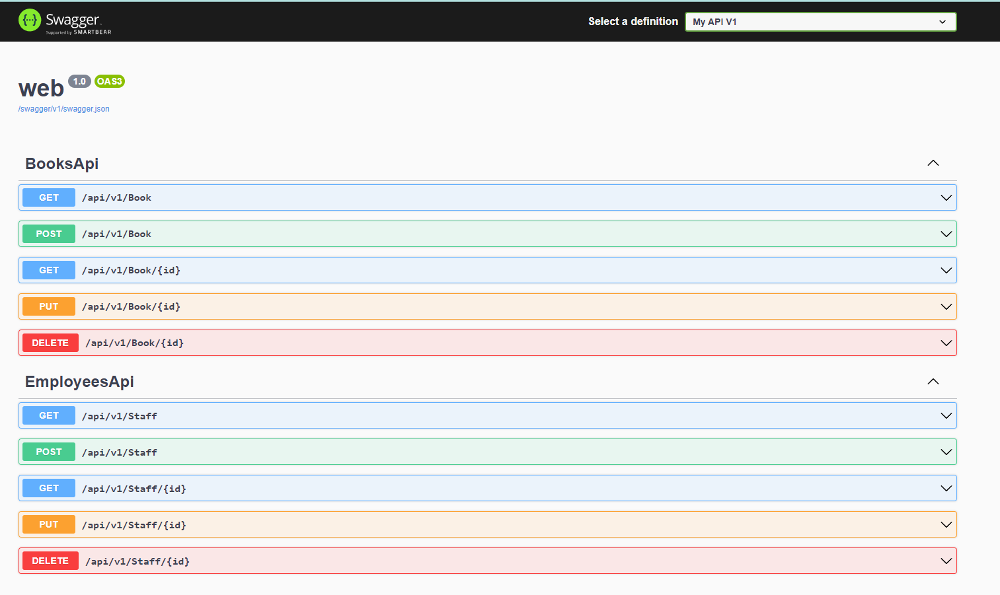
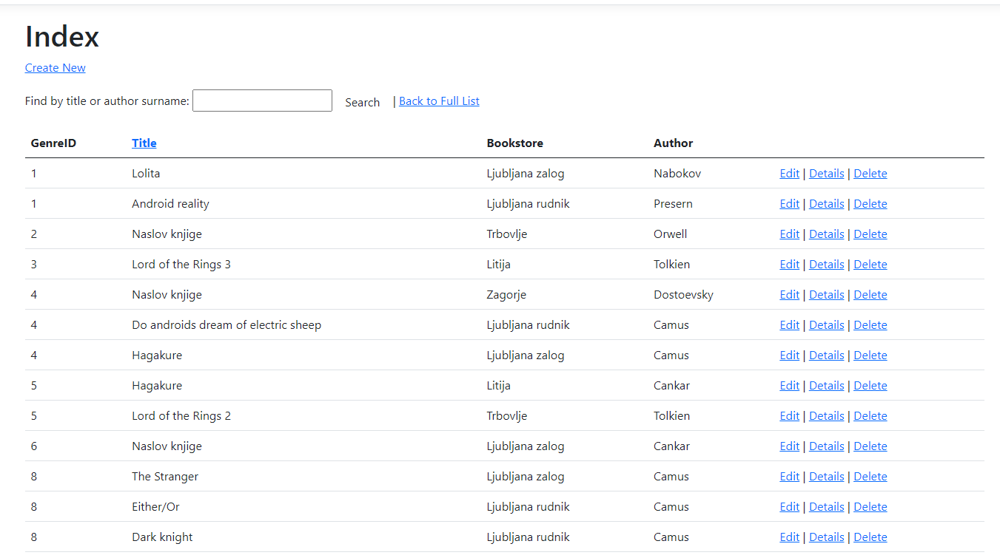
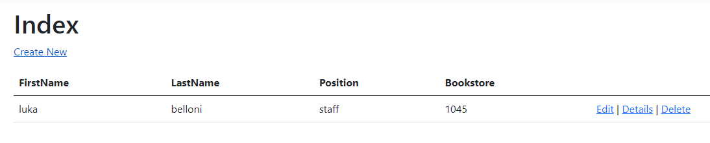

# IS-knjiznica

e-Knjiznica

Sistem je zamišljen kot spletna knjižnica, ki navadnim uporabnikom omogoča rezervacijo knjig. Določene knjige se lahko bere tudi online. Uporabniki
s dodatnimi privilegiji, pa lahko nadzorujejo tudi zaposlene.

Slika modela v PowerDesignerju

Nalogo sem izdelal sam.

